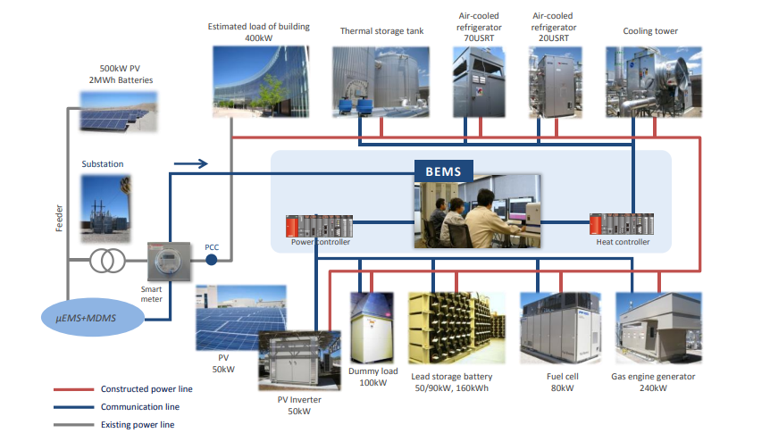

# Fase 01 — Explore: Análisis y Limpieza del Dataset
Este documento explica cómo trabajar con la Fase 01 (`01_explore`) del pipeline.Su objetivo es explorar el dataset RAW, aplicar limpiezas iniciales y generar un dataset intermedio listo para la fase 02.


## 0. Contexto del Proyecto
Trabajamos con el **MDS Dataset**, que contiene mediciones de un edificio inteligente con microred eléctrica en el **Aperture Center** (Albuquerque, EE. UU.). El sistema gestiona paneles solares, baterías, generadores de gas y pilas de combustible mediante un sistema inteligente (BEMS).



El conjunto de datos recoge las medidas de potencia, voltaje, frecuencia y temperatura  correspondientes a un periodo de aproximadamente **15 meses** (mayo de 2022 – julio de 2023). 

## 1. Configuración de Variantes

Una **variante** (`vNNN`) es una configuración específica de parámetros. Esto permite experimentar con distintas estrategias de limpieza manteniendo la trazabilidad.

```bash
make variant1 VARIANT=v001 RAW=data/raw.csv [opciones]
```
#### Parámetros de configuración

| Parámetro | Relevancia | Descripción | Ejemplo |
|-----------|-----------|-------------|----------------------|
| `VARIANT` | Obligatorio | Identificador único (`v001`, `v002`...) | `v001` |
| `RAW` | Obligatorio | Ruta al archivo CSV original | `data/raw.csv` |
| `CLEANING_STRATEGY` | Opcional | Estrategia de limpieza aplicada : `none` (defecto),  `basic` , `full` |  `basic`  |
| `NAN_VALUES` | Opcional | Lista de valores a tratar como NaN | `'[-999999]'` |
| `ERROR_VALUES` | Opcional | Diccionario JSON de valores erróneos | `'{"voltage":[-1]}'` || `FIRST_LINE` | Opcional | Primera línea del dataset a procesar (por defecto: 1) | `100` |
| `MAX_LINES` | Opcional | Número máximo de líneas a procesar desde `FIRST_LINE` | `10000` |
#### Estrategias de limpieza

- **`none`**: no aplica limpieza.
- **`basic`**: convierte en NaN los valores definidos en `NAN_VALUES`.
- **`full`**: aplica `NAN_VALUES` + reglas específicas por columna de `ERROR_VALUES`.

#### Procesamiento parcial del dataset

Los parámetros `FIRST_LINE` y `MAX_LINES` permiten procesar solo una porción del dataset original. Esto es útil para:

- **Pruebas rápidas**: Experimentar con diferentes estrategias de limpieza sobre un subconjunto de datos.
- **Desarrollo iterativo**: Validar el pipeline con datos reducidos antes de procesar el dataset completo.
- **Análisis temporal**: Seleccionar períodos específicos del dataset (ej: procesar solo el primer trimestre).

> **Ejemplo:** Para procesar desde la línea 1000 hasta la 11000 (10.000 líneas):
> ```bash
> make variant1 VARIANT=v003 RAW=data/raw.csv FIRST_LINE=1000 MAX_LINES=10000
> ```

> **Nota:** A continuación se muestra un ejemplo completo de creación de variante con parámetros específicos.
>
> ```bash
> make variant1 VARIANT=v005 RAW=data/raw.csv \
>   CLEANING_STRATEGY=basic \
>   NAN_VALUES="[-999999, None]" \
>   ERROR_VALUES='{"Battery_Active_Power":[-1],"MG-LV-MSB_Frequency":[-327.0]}' \
>   FIRST_LINE=1 \
>   MAX_LINES=50000
> ```
>
> El archivo generado `executions/01_explore/v005/params.yaml` quedará:
>
> ```yaml
> cleaning_strategy: basic
> nan_values:
>   - -999999.0
> error_values_by_column:
>   Battery_Active_Power:
>     - -1
>   MG-LV-MSB_Frequency:
>     - -327.0
> raw_dataset_path: data/raw.csv
> first_line: 1
> max_lines: 50000
> ```

## Flujo de trabajo recomendado

### Paso 1: Inicialización

```bash
make variant1 VARIANT=v001 RAW=data/raw.csv CLEANING_STRATEGY=basic NAN_VALUES="[-999999]"
```

### Paso 2: Ejecución

El código fuente de esta fase reside en `scripts/01_explore.py` y el notebook en `notebooks/01_explore.ipynb`. Ambos realizan exactamente las mismas tareas: cargar los datos, diagnosticarlos y aplicar la limpieza definida en tu variante.

Puedes elegir cualquiera de estas tres formas para ejecutar la fase:

#### Opción A: Ejecución automática del Notebook

```bash
make nb1-run VARIANT=v001
```

Ejecuta todo el notebook de principio a fin desde la terminal, inyectando los parámetros de tu variante.

#### Opción B: Ejecución mediante Script (Producción)

```bash
make script1-run VARIANT=v001
```

Es la forma más rápida y eficiente. Se recomienda una vez que ya tienes claros tus parámetros y solo quieres generar los archivos de salida.

#### Opción C: Ejecución manual en Notebook

Si prefieres trabajar dentro de la interfaz de Jupyter o VS Code, abre `notebooks/01_explore.ipynb` y busca la segunda celda. Allí podrás forzar la variante que necesites:

```python
# En la segunda celda del notebook:
env_variant = "v001"  # Descomenta y asigna el ID de tu variante aquí

```

> Nota: Al asignar este valor, el notebook ignorará cualquier configuración previa y cargará los parámetros de executions/01_explore/v001/params.yaml.


### Paso 3: Verificación
Asegúrate de que todos los archivos se han generado correctamente:
```bash
make script1-check-results VARIANT=v001
  ```

## 3. Artefactos Generados (Salidas)

Los resultados se guardan en `executions/01_explore/<VARIANT>/`:

- **`01_explore_dataset.parquet`** — Dataset procesado y optimizado (salida principal)
- **`01_explore_report.html`** — Informe con figuras. Ábrelo en tu navegador para validar visualmente la calidad de los datos.
- **`01_explore_metadata.json`** — Metadatos del proceso (fechas, conteos de filas)
- **`params.yaml`** — Copia de los parámetros utilizados para asegurar la trazabilidad
- **`figures/`** — Directorio con figuras generadas


