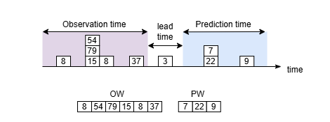

# Fase 03 — PrepareWindowsDS: Ventanas Temporales

En esta **Fase 03** (`prepareWindowsDS`) transformamos el dataset de eventos discretos, generado en la **Fase 02**, en un formato de ventanas deslizantes. 

> ⚠️ **Prerequisito:** Debes haber ejecutado correctamente la Fase 02  
> (necesitas una variante `vNNN` disponible en `executions/02_prepareeventsds/`).

## 0. Concepto Clave: Ventanas Temporales

Para que un modelo aprenda a predecir el futuro, necesitamos presentarle los datos en parejas de Pasado (Observación) y Futuro (Predicción).

#### Componentes de una ventana

| Componente | Descripción |
|------------|-------------|
| **Observation Window (OW)** | Contiene los eventos ocurridos en los últimos instantes temporales |
| **Prediction Window (PW)** | Contiene los eventos que ocurren después de la ventana de observación |
| **Lead Time (LT)** | Separación temporal entre la ventana de observación y la de predicción |

De forma esquemática:



> 💡 **Objetivo:** Aprender relaciones del tipo:  
> *"Dado lo que ha ocurrido en la ventana de observación **OW**, ¿qué eventos ocurrirán en la ventana de predicción **PW** tras esperar un tiempo **LT**?"*

### Estructura del dataset final de la fase 03

El dataset generado en esta fase tiene una estructura **por ventanas**, no por instantes individuales.
Cada fila representa una muestra de entrenamiento completa.

| Columna | Descripción |
|---------|-------------|
| `OW_events` | Lista de `event_id` en la ventana de observación |
| `PW_events` | Lista de `event_id` en la ventana de predicción |

### Ejemplo conceptual

| index | OW_events | PW_events |
|-------|-----------|-----------|
| 0 | `[12, 45, 78]` | `[90]` |
| 1 | `[45, 78]` | `[]` |
| 2 | `[78, 90]` | `[102, 110]` |

## Catálogo de Eventos

La correspondencia entre código de evento y significado físico se encuentra en el catálogo generado en la fase 02 padre:

```
executions/02_prepareeventsds/<variante>/02_prepareeventsds_event_catalog.json
```

Este archivo es esencial para interpretar los `event_id` en las columnas `OW_events` y `PW_events`.


## 1. Configuración de Variantes

```bash
make variant3 VARIANT=v111 PARENT=v011 OW=600 LT=300 PW=600 WS=synchro NAN=preserve
```

### Parámetros

| Parámetro | Descripción |
|-----------|-------------|
| `VARIANT` | Identificador de la nueva variante |
| `PARENT` | Variante de Fase 02 sobre la que se construyen las ventanas |
| `OW` | Tamaño de la ventana de observación (en segundos) |
| `LT` | Lead time entre OW y PW (en segundos) |
| `PW` | Tamaño de la ventana de predicción (en segundos) |
| `WS` | Estrategia de ventana (`synchro`, `asynOW`, `withinPW`, `asynPW`) |
| `NAN` | Tratamiento de valores faltantes (`preserve`, `discard`) |

> Los parámetros efectivos quedan registrados en el archivo `executions/03_preparewindowsds/vNNN/params.yaml` de la variante.

## 2. Flujo de Trabajo Recomendado

### Paso 1: Inicialización

```bash
make variant3 VARIANT=v111 PARENT=v011 OW=600 LT=300 PW=600 WS=synchro
```

### Paso 2: Ejecución

El código reside en `scripts/03_preparewindowsds.py` y el notebook en `notebooks/03_preparewindowsds.ipynb`. Elige tu vía:

**Opción A: Ejecución automática del Notebook**

```bash
make nb3-run VARIANT=v111
```

**Opción B: Ejecución mediante Script (Producción)**

```bash
make script3-run VARIANT=v111
```

**Opción C: Ejecución manual en Notebook**

Abre el notebook y configura la **cuarta** celda:

```python
env_variant = "v111"  # Descomenta y asigna tu variante
```

### Paso 3: Verificación

Asegúrate de que todos los archivos se han generado correctamente:

```bash
make script3-check-results VARIANT=v111
```

## 3. Artefactos Generados (Salidas)

Los resultados se guardan en `executions/03_preparewindowsds/<VARIANT>/`:

| Archivo | Contenido |
|---------|-----------|
| `03_preparewindowsds_dataset.parquet` | Dataset Final. Listo para alimentar modelos de IA. |
| `03_preparewindowsds_report.html` | Informe Final. Estadísticas de balanceo de clases y densidad de ventanas. |
| `03_preparewindowsds_metadata.json` | Información técnica del enventanado y tiempos. |
| `params.yaml` | Registro de la configuración (OW, PW, LT, etc.). |
